# i&gt;Clicker Quick Start {#i-clicker-quick-start}

i&gt;clicker 2 - Faculty Quick Start Guide

Software

The i&gt;clicker software is packaged in a single folder which includes the i&gt;clicker app as well as the Blackboard integration for use at SDSU. You can download the latest version of i&gt;clicker for use BlackBoard from the ITS website, [http://its.sdsu.edu/tech/iclicker/download](http://its.sdsu.edu/tech/iclicker/download). Computer specific directions for installing the i&gt;clicker software can be found on the Download Page, listed above.

Instructor Kit

Pick up your i&gt;clicker kit at the ITS Faculty Instructional Technology Center (FIT Center) in AH-1109\. Call 4-6348 to set up your appointment for training and to pick up your Instructor Kit.

Your Instructor Kit will contain:

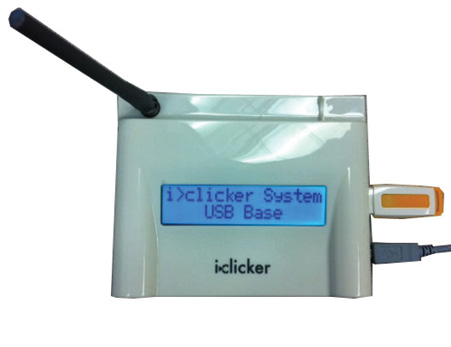

Base Reciver

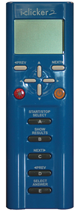

Instructor Device

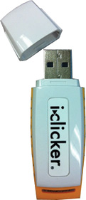

Flash Drive

Setting up your Course

Open the i&gt;Clicker app from inside the folder that you previously unzipped.

Create a new course by clicking the “+Create” button.

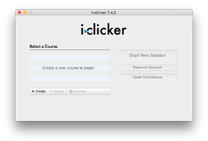![](data:image/png;base64,iVBORw0KGgoAAAANSUhEUgAAAH0AAAA/CAYAAADNEMdCAAAACXBIWXMAABcRAAAXEQHKJvM/AAAGkElEQVR4Xu2dW2xURRjHuxeuIq22peyCpV2oZXftOSQEL1xSxCiXSnoxAbkpIInIJdJabLu1FwroiyGoRKOJPhhDvCRenkQxKvFBHwQViAoaE4W2VrsvEn0wtuPMnP1OD80O3+np2e5u+Zr80uzu/8xp8u98M983M2dzGGM5hDOe0Fbv2xqt3AWvfV6vD7smE0AFhJoj+rpX+nO6WL22qh3e4z9eD//Brk0nqIBQ06xXdcY9nSzuaWfvaNtP5k2dNgE+473ei12fLlABoSamrT0Y97axeG6LNP5CcWN8eahiCXzu9/kyMtyjAkINmN5X1DLYM7N5MO57igm2RSt3gkb0eB7yMyrcowJCjcV0SXdR00DcH+O9voM9p68/btXyYT5jwj0qINQMN11wOdg8EJ9uGH+mbN+v2qxQFPSZYjwqINQkMz3BYE9RM4Pxfm35onVwTSakdaiAUHMN06XxsteLcZ5P8jr06uet16YzrUMFhBrE9KFwL8Z5bzs7Ed35bUn+zBlwfbqMRwWEGjumC/jMfqCvoEUaz/8J/rk7pK2ENtKR1qECQo1d0yHcd0O45+ypuK8F2vEkfrD7uQUqINSM0HTJpWDTf0Za18ne0LeemDJx0kRob6yMRwWEGiemC0SP/yMR7i8WN/61PFRRCW2ORbhHBYQap6YLeEqXqOK1Jap4y/dBu6mu26MCQs1oTAf4xM4M96/qm9+7YdJk0/BUhXtUQKhxw3TZ6/nsvj8/JvP5r27deykcmBOGe6Qi3KMCQo1bpkvjRbiHKp6/lT0w/85NcB9RvnWz16MCQk2TVtUhJmOYoXbp5abLRRuR1nHzn1lQ97L1fm4ZjwoINbynH3Crp1uRVbypxqLNh9FHT8+dMWs23NONSV7SN0+Fd58l1Hw+f9d3n0V2nfm+pKFPjMWYiU4QM/u+opgR7qfH2L3zFphVvNGu0Sd9E6pGBALvjaLYghnolKG0zrhfh179LHgkQr1T45O+if0xxNgiq3iJcP+Wtv2jYF5BntV8zGQyPUvhvd5YtOHGXyxu/HNpaXQh+DXScZ5MzyIS4d4Y531tbMdtK/Y6MZ5Mz0LMRRtu/jF9w5tXGWpjnCfTs5Rucy9eJztd9vhP5UW3lIJ/WBWPTM9ijLSuJVHFi7H14cVb7BhPpo8DfhPhXqR13nbWpdccM81VhHoyfZwwtPVa7sX7urQgUEg9/TpAhHvYnCH+ATZFlq0h068DuouazArek9qa7WT6OObyzKaB/sRByrOh+t7FJZHbKbyPY7phb71Rpv102uQplLKNZy7BzF2G86pD4OG1tlWT6VmKeYDCIw9Q/L0ipN0D/mElWTI9C7GmZ59EHztXWhjIB++8NmrwZHqWIQsx/laZlh3Wa68qxNhdZiXTs4Rec4WtXZZcHwwv2QB+jfT4M5meBYhwbmyR7mTnQvXiQQfznRquNF1O/wmc3MSEyoZxTjEPQ3jb2OvaQ+9bfbIbzm2Zfj7U0GuhZ9hru5+li5T/vby39XAu/zJ7/xUxg8aMc4K5gpZIx7ZGK80NE36fz/2NkaHCQIBQM+umwvyCabmep/W6I2IHC2bgSLGeePm5eP+VxSWRuyyGjzic2zKdsEeDtrrFzcMOAhnOxSZI3u5xfdvJYF7BzXA/O+mYHVABocb1Y02w3Zm3WV+x6gDch441ZRBumS4MF79FOBeTwxVzNXNJFKuuOQEVEGrcMH1or1sH+ziy85twYM48aD8VhgtQAaFmtKabjxzjbXTpNS9Bu26G8mSgAkKNU9Ov2r/ub2UbI0sfgTbdHr+TgQoINU5MF+kYhPMvwnt+iARKRlVdcwIqINSM1PShJ0u1s9f0LR/caNnskOrebQUVEGrsmi5SMZmOeY2HCj1sqa7xuZrt1TG3QAWEGjumC7NldY3rzoca4ktKInfA9amanWOgAkINZvpQOO9g71bs+DKQl28eMXaruuYEVECoUZku1r6NdKxN9vC9FSutX+wz5uF8OKiAUJPMdOv5Mv7739VlC6tBP1azcwxUQKgZbrrYew7p2Knw7h9DhcEgaD0Z8q0OAlRAqLF+cY/xXPdWubvlkF6bMQ/0TwYqINSA6fKhf2L8nhpjmyPLtsHnbqx9pwJUQKhp1u7vlCtjPJxfKG78fVFx+QL4LF3pmB1QAaHmsF73Qn/OYfaivvFt6/uZNH4nAxUQag7qtQe69Jqj8DrTzQZQAZGcCT6/N5hXYH4rAw/nGTVZuxb/A3q1k+h0LxpUAAAAAElFTkSuQmCC)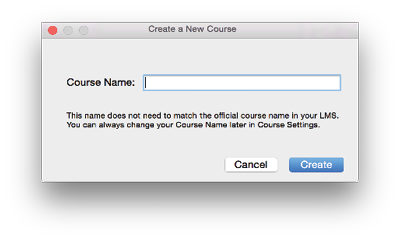

Highlight the name of your newly selected course.

Click “Settings” to configure your course and integrate it with BlackBoard.

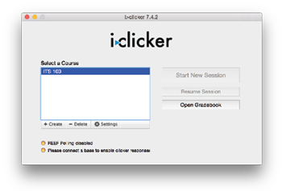![](data:image/png;base64,iVBORw0KGgoAAAANSUhEUgAAAH0AAAA/CAYAAADNEMdCAAAACXBIWXMAABcRAAAXEQHKJvM/AAAGi0lEQVR4Xu2cW0wcVRjHYZdSSpFtYekst4KwsFcGbInYorFNA2IkkdZEaAgJ1FrWKiFeKrcuVI3GxMRobUwaL/Gl4kOTRkvTYts00Row+GAaTZpUm6hAUwV9kMQXYTxnhjMcNmf59jILu/iR/FI6+585JL+cb+ZcZpMURUlCwqc425Z3yem70uysfZodM5tMJui8eAAMIGK2bMrYNG7vujWbfEJ5RW56m/8smfxA568lYAARk7U5c/NFd+fYrPm4MmsaVM67j4zZLNnb2OemOO71YAARQ6WPun3fzqYMKHelPlX8lNQ7V2+vqmOZeBUPBhAxgdIn83oX1F5P/n/UWzfIcqTSx514MICICZROmaLiU/qV2eRB5XRl6xcbzClmlo+n+zwYQMSIpKvipZ75mex+tdzfKH5+prqwfCc7J17EgwFETDDplDtS78K0jZZ7vzJj6VNaXQ/52HnxMKwDA4iYlaQzyH1+Xi33pNe/KT/xCd/T17LXgwFETCjSWbmfzdTEj5V33bbn5Jewa6yVeDCAiAlVOoWWenVYR8r9HWvffGNZdTO7TorZbA7WRqwAA4iYcKQv6/UkT4d2L1c89ha7VvLiD9SmUYABREwk0lXx9D6fTod1J5Rz3sPXpcysLHbN1RIPBhAxkUqnTEtL5f7nvGNz+0orH2XXJU/3MS/3YAARE410hvp0T2fxCH1y4zvs2rHu8WAAEWOEdF18ujaLN1zRcTU9deMm1kas5IMBRIxR0in06f53q7Zoc8357O3K/NJq1k4sJnPAACLGSOkMvtwf9ux9gbVl9NM9GECCc8HT+Y2R0inT+iyeXzklH/yMb88o8cKDDxQ5a3h2FbtCIvC8WAD9DaECtlMU/Fw5v8Szt0Te87XjuR+oIEhkuOizeOQ+/6XL9z1pz83cGLFGLzxI7y8IyAIkL1rIvV7R1uj7laby+9uNEi88qD5NIiB3pX59zB0LFlfr1I0ZtNy/IR84xRzRUp+UlBRRuRcehP4YZHVRH/AWF23Oep/6qiQnT+LlQ5JReoKiz+KRHj8l9f7VYN/RwHyFO6xD6YnFgn6fJ/K7vPV+5ox0eFOovR6lJyCT3LBuWO64Ys2wWDj5oHiUnqCQHj9PRxH0Pv9dafdvOwvK7mP+oHKP0hMY9eleYsO6AeXQ8lm8oOJR+jpAL/fJg8rJyuYzG8wpK5Z4lL5OoIs22tZrv3LVdfSGQyosQ+n/A6bZZA7p8bTkt7hqa1H6Ooffcv2x3HbeYSuURH5R+jpBe7lCe6Aj4/ehYKUdpa8DtO3VWu/+Ja/n791F7t3MY7AxO0pPYCZtPQvq4g8RfkZuvyxlZm3lhOOQbb2hvhq9uPo2JD9+ku/d0KwcSk8w9LdlSO+esfT902DfsZ95g2biUHoCQqdetSVWvzLiOTJ+rzU3lzkLZ2MFSk8QVOGLiyyvyweW7ZGHyjlKTzD4t2Go9AOOmhbmKdRyHpJ0tQEkOCb673GFTnvSTYyQuEhRN0hatPv3qNt3syrf7o1WeFDpp+XWz5HgnJJbzn4kt43c3P7in1QKJC8S+DXz9+WD54jkVEhmqIABJDgXPZ3Xjd73rm+GVF968Csdnoe7WHvRbIbkAQOImIzUtI2X3J3jRkqn92+2MWKitHuqZrvzQdZeNOU8EDCAiDH6taZJW4/2IiMp55/K7dfytlitrC0jejcPGEDEGCV96ZuotK8b7fTuO8HaMKqcBwIGEDEGSdeHY5PkSb3BvqOJXd/Ich4IGEDERCtdLefq+2pDyqjHN+GQCsvZtcOdbAkXMICIiUa6Nrs2oPbw1+T9H/DXjbVwChhAxEQifdnsGnloa+Jm11ZaCjUaMICICVc6P7t22fXMj+7cIie71moKp4ABREw40vktyu/KzcP8dVajnAcCBhAxoUgnwzHt68BpOSfSD7n3HGPnh7MUajRgABEDSV967chPvwL8zq4il74dOZbDsVAAA4iYlaTz3wr5odx2IT01LY2dtxblPBAwgIgJJl2dXaPDMUJ3xSOvsnysZtciAQwgYgKlL+1d8yu/Sj1zdfaqRpZd63IeCBhAxPDS9b1r5Ol8xNM5kb81R9+7Fg/lPBAwgIhZlD6uDsX0vWv73+Mz8SicAgYQMXpPJw9rpJf/+6Rzdzv7LN7KeSBgABFjzbDcc6vgpT9+Kjg2J+eXOtjxeO3dPGAAEVOYtS23y1vflZ2RmcGOJYJwChhAxPAzauTXhJDN+A/gYWG2xwkBXQAAAABJRU5ErkJggg==)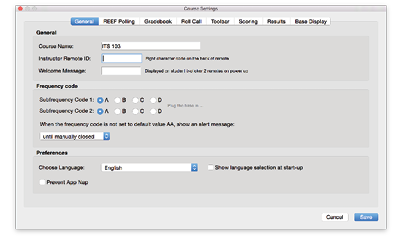

General Settings

Starting off in the General Tab of the settings window.

Enter your Instructor Remote ID, which you can find on the back of your blue remote.

Enter this number with care as you have the ability to start and stop polls, display results, and set the correct answer from your Instructor Remote.

In most cases, you will be using frequency AA, see Appendix A in the Userguide for how to change the frequency on your base and remotes. If you get a frequency conflict message, see [http://bit.ly/1IYUH6x](http://bit.ly/1IYUH6x).

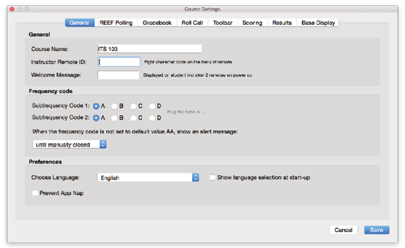

Setting Up Your Gradebook

i&gt;clicker integrates with Blackboard, which makes it easy to download your roster and upload grades.

Click on “Select Course” to start the connection process.

In order to integrate with Blackboard, you will need to make your course available and configure i&gt;clicker to talk with your Blackboard Course.

In your Blackboard course, go to the Course Tools in the Control Panel. Click on “i&gt;clicker Instructor Tools”.

You will need to obtain an SSO key, which is listed under “SSO Security Key” once you access the Instructor Tools for

i&gt;clicker.

Copy your SSO Key, you will need it when you try to login inside the i&gt;clicker app.

Back in the i&gt;clicker app, go to the “Gradebook” tab and click on the “Select Course” button. A login window will appear, use your Blackboard Username (your RedID) and paste in your SSO key that you got from Blackboard.

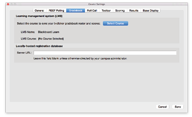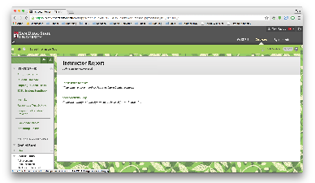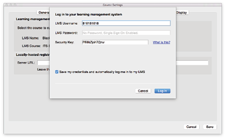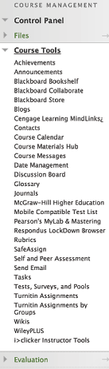

Setting Up Your Gradebook Continued...

Once you login, all of your available courses will be listed. Choose the course that corresponds with the course name that you chose earlier.

Once you select your course, you will be notified that your roster will not appear until you sync with your LMS; this message can be safely ignored, as you will sync your roster using the i&gt;clicker gradebook.

Toolbar

While you are polling your student,

i&gt;clicker will display a small Toolbar on your screen, which displays pertinent information for both you and your students.

The most important option is the Timer, by default, polls only close when you close them. Many users choose to have a “Count Down” timer which closes the poll automatically when the time elapses.

You can enter the desired poll duration in the box using the Minutes:Seconds format and the dropdown menu.

Scoring

Think of the Participation Points as “Attendance” and the Performance points as “Points Earned”.

Participation Points and Performance points can be uploaded to Blackboard as separate columns if desired (this is set when syncing scores to Blackboard).

Many instructors are moving away from “Participation Point”, favoring “Points for responding” to keep students Engaged.

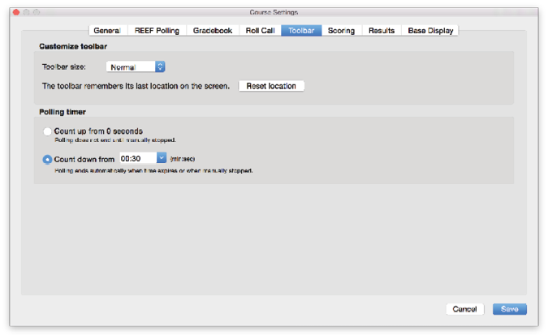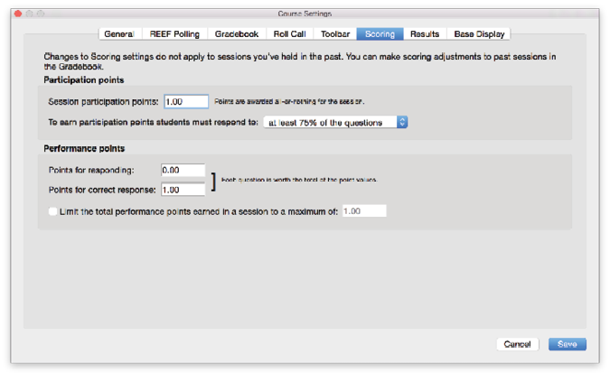

Gradebook

Let’s take a look at your Gradebook. Your Gradebook will contain all of your session information, as well as the grades your students receive on clicker-based

activities.

Open your Gradebook by clicking on the “Open Gradebook” button on the start page.

The first time you open up your roster, it we be empty.

Click the “Sync Roster” button to connect to Blackboard and download all of your students and the clickers that they registered.

Names in Blue have registered a Clicker or REEF Pooling account to their account and their scores will be uploaded to Blackboard once you have synced. Names in Red DO NOT have clickers registered and their scores will be saved but not uploaded until they register their remote.

Running a Session

Once you have connected your

i&gt;clicker base to your computer, the “Start New Session” button will become active.

Click the “Start New Session” button to start a new Polling Session.

We recommend you start a new session, then start your PowerPoint Presentation, so you don’t have to switch back and forth.

If a frequency error appears, you will need to change the frequency of your base and remote. See Appendix A in the User Guide on how to change the frequency of your base and remote.

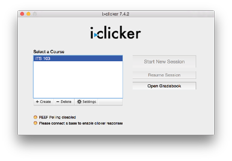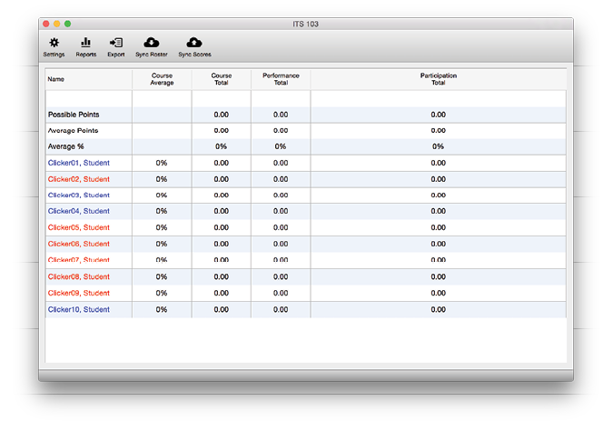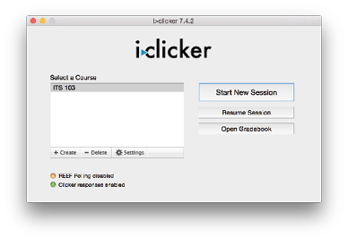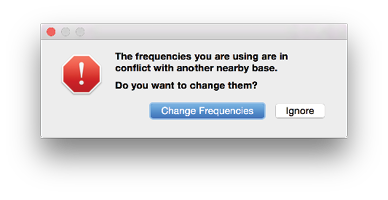

Running a Session Continued...

Once you start your session, the Session Toolbar will appear. The tool bar provides you with a summary of your poll and allows you to start and stop the poll if you do not have or do not want to use your Instructor Remote.

Once you start your session, the timer will begin to count. It will count up or down, depending on how you configured your settings. Also, on the far right, you can see how many students have participated in your poll.

Click the Stop button (the red square) to stop your poll, or press the “A” button on your remote.

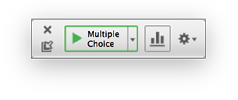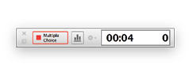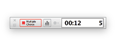

Showing Responses in Class

You can display the results from your poll in class after you close the poll. Click on the Bar Graph button in the toolbar or press “B” on your instructor remote to display the Results Chart.

The Results Chart displays a breakdown of how your students voted during your poll.

You can change the question by clicking the Question Menu, or you can use the forward and back arrows in the top left corner.

You can also compare results, simply click the compare button and another Results Chart will appear.

Pressing “B” will close all the open Results Charts.

Designating Correct answers in Class

While you have a Results Chart open, you can press the “Answer” button, or press “E” on your Instructor Remote to step through the answer choices.

The Selected Correct Answer will turn green and when you end the session, the student scores will reflect the correct answer selected in class.

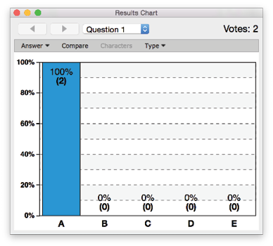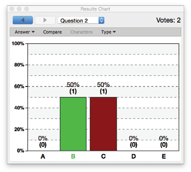

Evaluating Sessions

Once you are ready to evaluate your session, go back into your gradebook and a new column will have appeared for the session that you completed.

Click the “View” button at the top of the column start processing your session.

i&gt;clicker takes a screenshot of your screen everytime you start a poll, this makes scoring easy!

Check the checkbox next to the correct answer for each question; the Correct Answer will turn green, and the wrong answers will turn red. You will need to do this for every question.

It is possible to do this while you are polling, see Advance Usage on page 6.

Open the session summary window by clicking on the “Summary” button in the top-left.

Change the session name to something recognizable as it will be the name of the column in Blackboard when you upload your scores. For Example, the Date or the topic of the quiz or in-class activity.

Uploading Scores to BlackBoard

When you are ready to upload your scores, go to your Gradebook and click the “Sync Scores” button.

We recommend that you sync your roster before you sync your scores.

Choose the session that you want to upload, and click “Next”.

Finally you can configure how you want your scores uploaded. Many students prefer that each session be uploaded as a separate entry as it gives them greater insight into their grades.

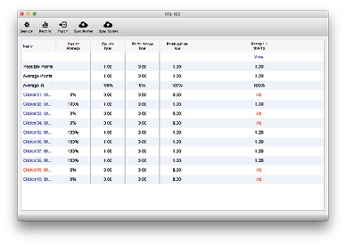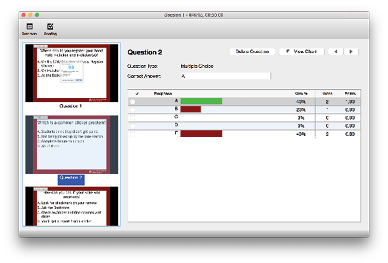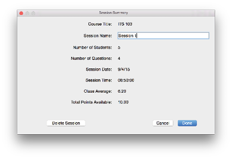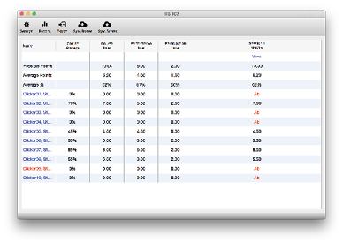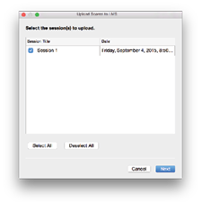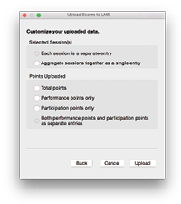