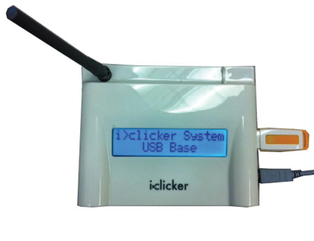
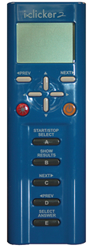
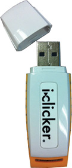

# i>Clicker Quick Start Guide
i>Clicker is an in-class response system that can be used to quickly and easily poll your students during class. This can be used to be comprehension quizzes, before-and-after comparisons, and more.

The i>Clicker system is composed of a base receiver which is connected to a computer (or in-class podium), an Instructor Remote (optional), and a group of student remotes. Each student should have their own remote, as that is how the software associates their responses with their RedID.

## Software

The i>clicker software is packaged in a single folder which includes the i>clicker app, as well as the Blackboard integration for use at San Diego State University. The latest version of the software can be obtained by visiting the FIT Center, which is located in Adams Humanities, Room 1109.

## Instructor Kit

Instructor kits are available free of charge for instructors at San Diego State University. To pick up your i>clicker kit at the ITS Faculty Instructional Technology Center (FIT Center), please call 619-594-6348, or [scheduled online](https://fitcenter.acuityscheduling.com/schedule.php?appointmentType=1226211) to set up your appointment for training and to pick up your Instructor Kit.

Your Instructor Kit will contain:

|  |  |  |
|: -- |: -- |: -- |
| Base Receiver | Instructor Remote | Flash Drive |

## License

 This work is licensed under a <a rel="license" href="http://creativecommons.org/licenses/by-sa/4.0/">Creative Commons Attribution-ShareAlike 4.0 International License</a>.