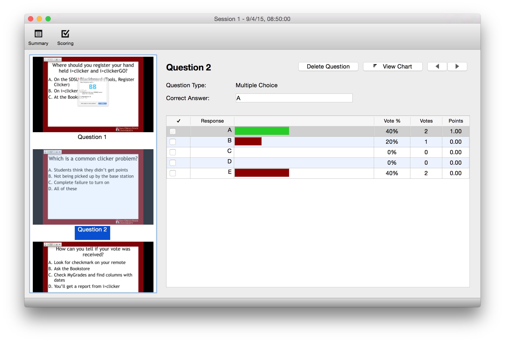
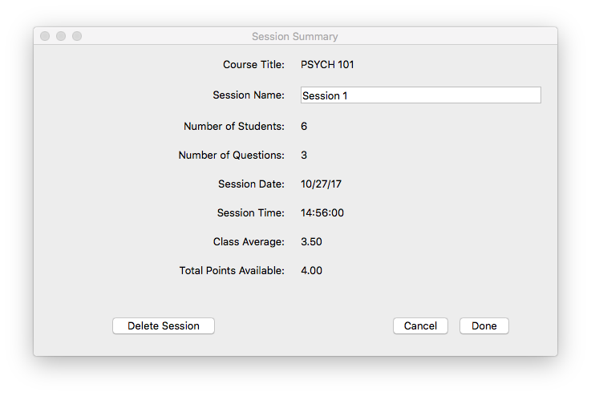

# Evaluating A Session

Once you are ready to evaluate your session, go back into your gradebook and a new column will have appeared for the session that you completed.

## Grading Responses

Click the `View` button at the top of the column to start processing your session.  
iClicker takes a screenshot of your screen everytime you start a poll, this makes scoring easy!

Check the checkbox next to the correct answer for each question; the Correct Answer will turn green, and the wrong answers will turn red. You will need to do this for every question, if your scoring is based on correctness. If your scoring is based on participation/number of responses, it is not necessary to go through and mark correct answers.

## Session Summary

Open the session summary window by clicking on the `Summary` button in the top-left.

Change the session name to something recognizable as it will be the name of the column in Blackboard when you upload your scores. For Example, the Date or the topic of the quiz or in-class activity. This is also where you can delete sessions if desired.

