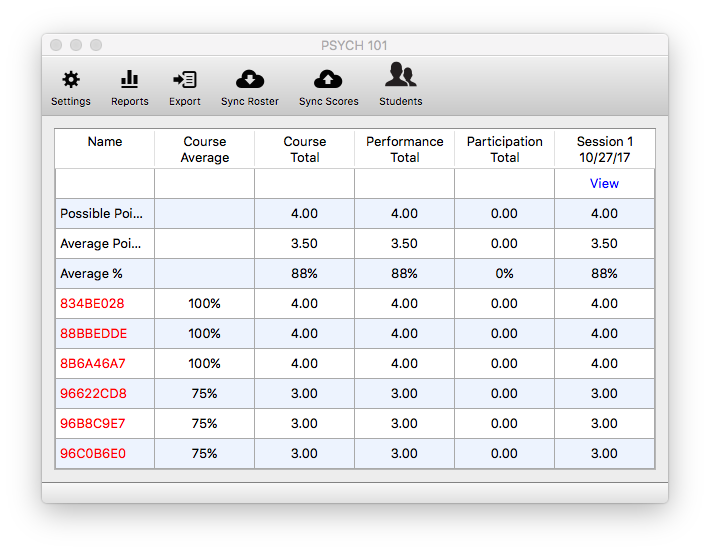
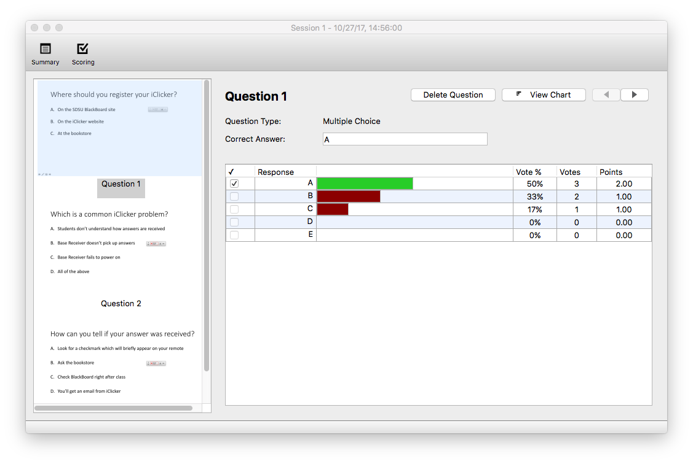

# Evaluating a Session

From your home screen, click `Open Gradebook`. A window will open where you will see a column representing performance and participation information for the sessions that you have completed.

## Grading Responses

Click the `View` button at the top of a session column to start processing your session.  
iClicker takes a screenshot of your screen every time you start a poll to make scoring easy!

Click the checkbox next to the correct answer for each question. The correct answer will turn green, and the wrong answers will turn brown. You will need to do this for every question, if your scoring is based on correctness. If your scoring is based on participation/number of responses, it is not necessary to go through and mark correct answers.

## Session Summary

Open the session summary window by clicking on the `Summary` button in the top-left.

Change the session name to something recognizable as it will be the name of the column in Blackboard when you upload your scores. For Example, the Date or the topic of the quiz or in-class activity. This is also where you can delete sessions if desired.

