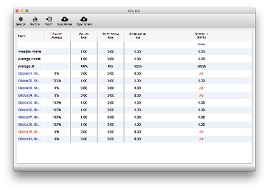

# Evaluating A Session

Once you are ready to evaluate your session, go back into your gradebook and a new column will have appeared for the session that you completed.

Click the `View` button at the top of the column to start processing your session.
i>clicker takes a screenshot of your screen everytime you start a poll, this makes scoring easy!

Check the checkbox next to the correct an- swer for each question; the Correct Answer will turn green, and the wrong answers will turn red. You will need to do this for every question. It is possible to do this while you are polling, see Advance Usage on page 6.
Open the session summary window by click- ing on the “Summary” button in the top-left.
Change the session name to something recognizable as it will be the name of the column in Blackboard when you upload your scores. For Example, the Date or the topic of the quiz or in-class activity.
