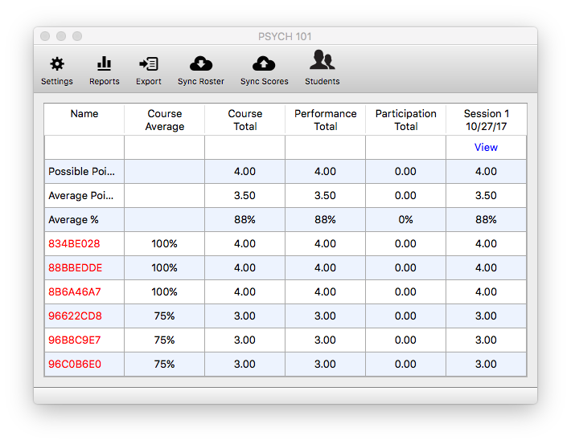

# Gradebook

Your Gradebook contains all of your session information including the grades your students receive on clicker-based activities.

Open your Gradebook by clicking on the `Open Gradebook` button. The first time you open up your roster, it will be empty. Click the `Sync Roster` button to connect to Blackboard and download all of your students and registered clickers.

Names in blue have registered an iClicker remote in Blackboard, or have created an iClicker Reef account.

Names in red are iClicker remote IDs which have responded to polling sessions, but are ** NOT** registered in Blackboard. Their scores are synced to the remote and will be saved, but will not be uploaded until the student registers their remote.

