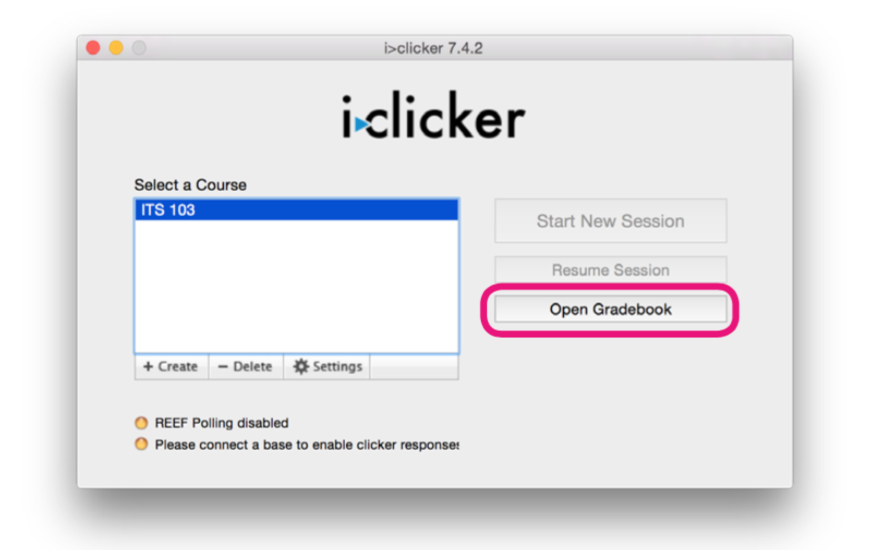
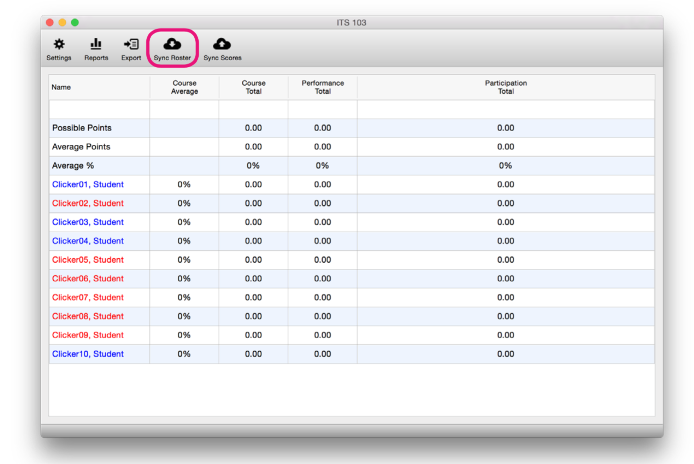

# Gradebook

Let’s take a look at your Gradebook. Your Gradebook will contain all of your session information, as well as the grades your students receive on clicker-based activities.

Open your Gradebook by clicking on the “Open Gradebook” button on the start page.

The first time you open up your roster, it we be empty.

Click the “Sync Roster” button to connect to Blackboard and download all of your students and the clickers that they registered.

Names in Blue have registered a Clicker or REEF Pooling account to their account and their scores will be uploaded to Blackboard once you have synced. Names in Red **DO NOT** have clickers registered and their scores will be saved but not uploaded until they register their remote.