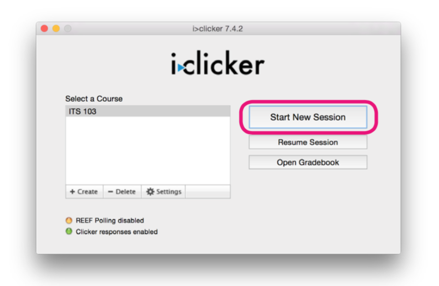
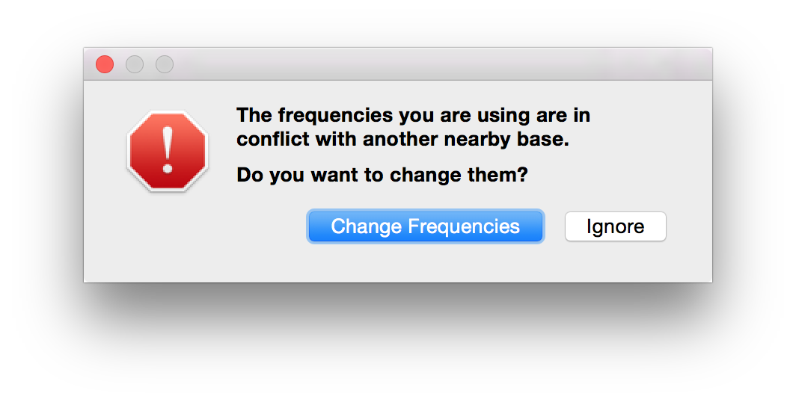
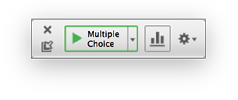
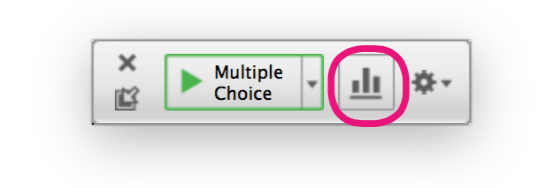
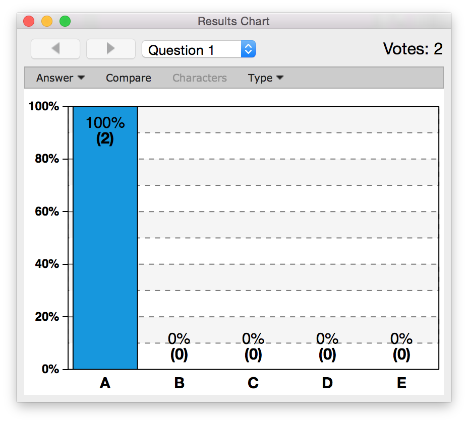
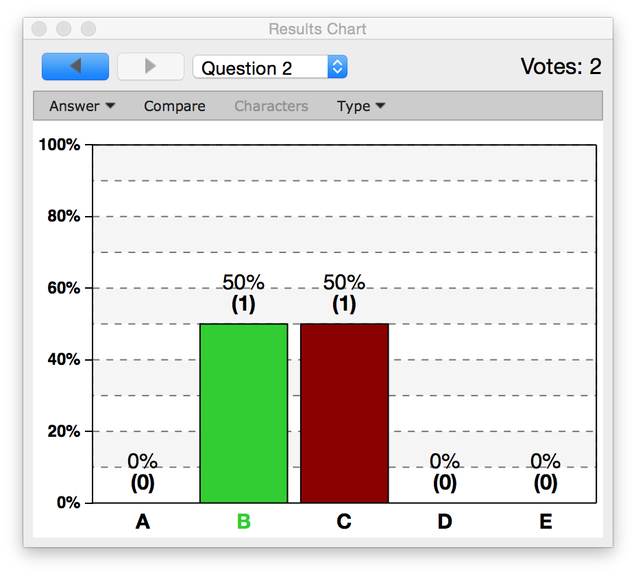

# Running A Session

Once you have connected your i>clicker base to your computer, the `Start New Session` button will become active. Click the `Start New Session` button to start a new Polling Session.

We recommend you start a new session, then start your PowerPoint Presentation, so you do not have to switch back and forth between the 2 applications.

If a frequency error appears, you will need to change the frequency of your base and remote. Take a look in the [Set Up](setup.md) instructions on how to change the frequency of your base and remotes.

Once you start your session, the Session Toolbar will appear. The tool bar provides you with a summary of your poll and allows you to start and stop the poll if you do not have, or do not want to use, your Instructor Remote.

Once you start your session, the timer will begin to count. It will count up or down, depending on how you configured your settings. Also, on the far right, you can see how many students have participated in your poll.

Click the Stop button (the red square) to stop your poll, or press the `A` button on your remote.

## Showing Responses in Class

You can display the results from your poll in class after you close the poll. Click on the Bar Graph button in the toolbar or press `B` on your instructor remote to display the Results Chart. The Results Chart displays a breakdown of how your students voted during your poll.

You can change the question by clicking the Question Menu, or you can use the forward and back arrows in the top left corner. You can also compare results, simply click the compare button and another Results Chart will appear.

Pressing `B` will close all the open Results Charts.

## Designating Correct answers in Class

While you have a Results Chart open, you can press the `Answer` button, or press `E` on your Instructor Remote to step through the answer choices.

The Selected Correct Answer will turn green and when you end the session, the student scores will reflect the correct answer selected in class.

