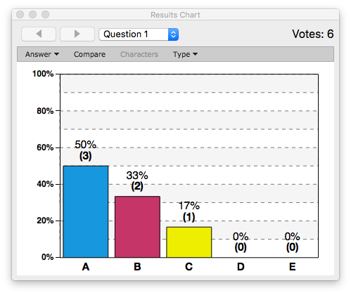

# Running a Session

Once you have connected your iClicker base to your computer, the `Start New Session` button will become active. Click the `Start New Session` button to start a new polling session.

We recommend that you start a new session before you start your  presentation, so that you do not have to switch back and forth between the 2 applications.

If a frequency error appears, you will need to change the frequency of your base and remote. 
The process of changing your frequency is explained in the [Setup](setup.md) section.

Once you click `Start New Session`, a toolbar will appear. The toolbar provides you with a summary of your poll and allows you to start and stop the poll which you can also do using your instructor remote.

Once you start the poll, the timer will begin to count. It will count up or down, depending on how you configured your settings. You can adjust the amount of time remaining by clicking on the up and down arrows. On the far right, you can see how many students have participated in your poll.

 

If your poll is counts up, you may click the red square on the toolbar to end your poll, or press `A` on your instructor remote.

### Showing Responses in Class

You can display the results from your poll in class after you close the poll. Click on the Bar Graph button in the toolbar or press `B` on your instructor remote to display the **Results Chart**. The Results Chart displays a breakdown of how your students voted during your poll.

You can change the question by clicking the Question Menu, or you can use the forward and back arrows in the top left corner. You can also compare results, simply click the compare button and another Results Chart will appear.

Pressing `B` on your instructor remote will close all the open Results Charts.

### Designating Correct Answers in Class

While you have a Results Chart open, you can press the `Answer` button, or press `E` on your instructor remote to step through the answer choices.

The selected correct answer will turn green and when you end the session, the student scores will reflect the correct answer selected in class.

You can press `B` on your instructor remote at any point in the session to hide the polling window.

Once you have finished your session, click the `x` in the top left corner of the toolbar window and you will be brought back to your home screen.