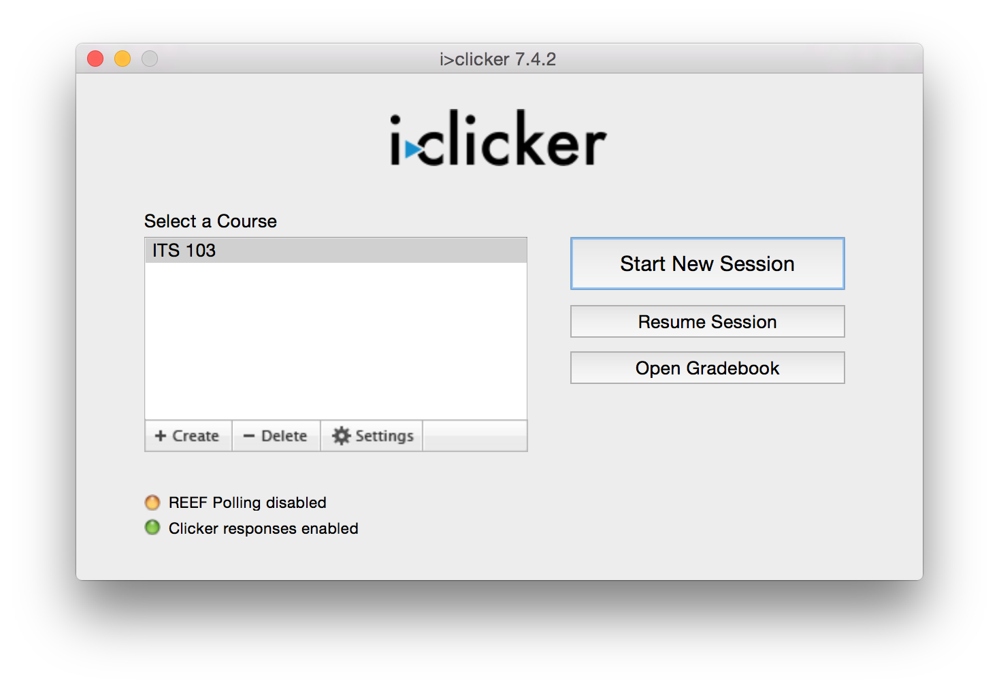

# Sessions

For every class meeting, you will want to run a new session. Each session is aggregated in the Grade Center, where you can view the responses from students, and grade the for correctness, if desired. Contrary to the belief of many students, results from polling sessions **do not** feed directly into Blackboard after you end the session. You will need to sync the scores between the iClicker software and Blackboard periodically. This process is described in the [Uploading Scores](upload_scores.md) Section.

If you accidentally end a session, you can resume the previous session by clicking on the `Resume Session` button on the home screen of the iClicker Software.  

