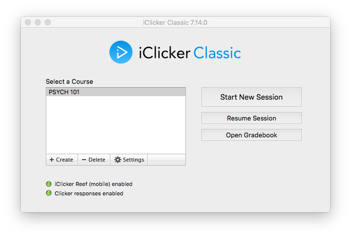

# Sessions

For every class meeting, you will want to start a new session. Each session is aggregated in the Grade Center, where you can view the responses from students, and grade them for correctness, if desired.

Results from polling sessions **DO NOT** feed directly into Blackboard after you end the session. You will need to sync the scores between the iClicker software and Blackboard. This process is described in the [Uploading Scores](uploading-scores.md) section.

If you accidentally end a session, you can resume the previous session by clicking on the `Resume Session` button on the home screen of the iClicker Software.

