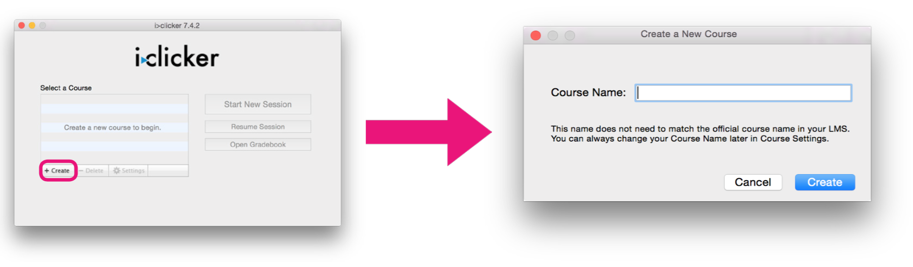
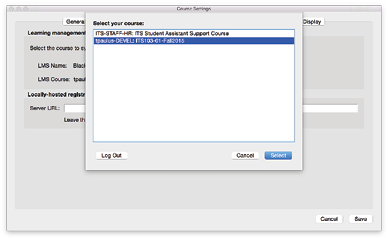
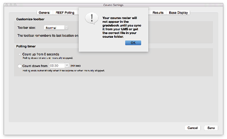

# Set Up

## Setting up your Course

Open the i>Clicker app from the i>clicker folder on your flash drive.

Create a new course by clicking the `+Create` button.

Highlight the name of your newly selected course.

Click `Settings` to configure your course and integrate it with Blackboard.

## General Settings

Starting off in the General Tab of the settings window.

Enter your Instructor Remote ID, which you can find on the back of your blue remote.

Enter this number with care as you have the ability to start and stop polls, display results, and set the correct answer from your Instructor Remote.

In most cases, you will be using frequency AA, see Appendix A in the Userguide for how to change the frequency on your base and remotes. If you get a frequency conflict message, see [http://bit.ly/1IYUH6x](http://bit.ly/1IYUH6x).

Setting Up Your Gradebook

i>clicker integrates with Blackboard, which makes it easy to download your roster and upload grades.

Click on “Select Course” to start the connection process.

In order to integrate with Blackboard, you will need to make your course available and configure i>clicker to talk with your Blackboard Course.

In your Blackboard course, go to the Course Tools in the Control Panel. Click on “i>clicker Instructor Tools”.

You will need to obtain an SSO key, which is listed under “SSO Security Key” once you access the Instructor Tools for

i>clicker.

Copy your SSO Key, you will need it when you try to login inside the i>clicker app.

Back in the i>clicker app, go to the “Gradebook” tab and click on the “Select Course” button. A login window will appear, use your Blackboard Username (your RedID) and paste in your SSO key that you got from Blackboard.

Setting Up Your Gradebook Continued...

Once you login, all of your available courses will be listed. Choose the course that corresponds with the course name that you chose earlier.

Once you select your course, you will be notified that your roster will not appear until you sync with your LMS; this message can be safely ignored, as you will sync your roster using the i>clicker gradebook.

Toolbar

While you are polling your student,

i>clicker will display a small Toolbar on your screen, which displays pertinent information for both you and your students.

The most important option is the Timer, by default, polls only close when you close them. Many users choose to have a “Count Down” timer which closes the poll automatically when the time elapses.

You can enter the desired poll duration in the box using the Minutes:Seconds format and the dropdown menu.

Scoring

Think of the Participation Points as “Attendance” and the Performance points as “Points Earned”.

Participation Points and Performance points can be uploaded to Blackboard as separate columns if desired (this is set when syncing scores to Blackboard).

Many instructors are moving away from “Participation Point”, favoring “Points for responding” to keep students Engaged.

Gradebook

Let’s take a look at your Gradebook. Your Gradebook will contain all of your session information, as well as the grades your students receive on clicker-based

activities.

Open your Gradebook by clicking on the “Open Gradebook” button on the start page.

The first time you open up your roster, it we be empty.

Click the “Sync Roster” button to connect to Blackboard and download all of your students and the clickers that they registered.

Names in Blue have registered a Clicker or REEF Pooling account to their account and their scores will be uploaded to Blackboard once you have synced. Names in Red DO NOT have clickers registered and their scores will be saved but not uploaded until they register their remote.
