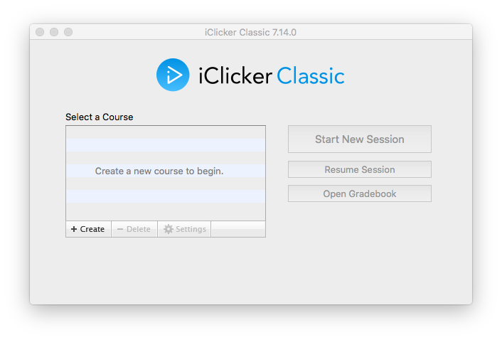

# Initial Setup

### Register

1. Open the **iClicker** app from the iClicker folder on your flash drive.
2. Enter your name and email.
3. Type "San Diego State University" in the **Primary Institution** Field.
4. Click `Register`.

### Create your Course

1. Create a new course by clicking the `+ Create` button.
2. Type in the name of your course (eg. PSYCH 101).
3. Click `Create`.

# Settings

1. Highlight the name of your course.
2. Click `Settings`.

### General Tab

1. Enter your **Instructor Remote ID**, which is found on the back of your blue remote. Enter this number carefully as this is used to start and stop polls, display polling results, and set a correct answer.
2. In most cases, you will be using **Frequency Code** AA
  
> **[info] Tips**
>
> You may want to turn off the frequency alert message as it will display
> every time you open the software. Click the drop down menu located 
> beneath **Show frequency alert message** and choose `not at all`.
>
> If you are using a Mac, you may want to check the box next to **Prevent** 
> **App Nap** to prevent your software from "sleeping" between questions.

### Registration Tab

The `Registration` tab does not require any alterations.

If you are going to allow web-based polling in your course, click the `Mobile` tab. If not, move on to the `Gradebook` tab.

### Mobile Tab

> **[warning] Attention**
>
> You should **NOT** create a separate **iClicker Reef** account outside of the
> iClicker application. Creating a separate iClicker Reef account on the 
> iClicker Reef website will create a new, separate course that is not linked 
> to your iClicker course and students will not be able to join polls or quizzes.
>
> Students who use iClicker Reef **MUST** enter their RedID 
> as their student ID in order to be recognized by Blackboard.

1. Click `Enable`
2. Fill in the required fields
3. Click `Sign In`

1. Enter "San Diego State University" in the **Institution** field, and select your **Course Discipline**.

2. Fill in the **Course Name**. It's a good idea to add the semester, too. (eg. Psych 101 Spring 2018)

3. Fill in the **Start Date** and **End Date**. The end date ensures that the course will no longer be visible to students after the semester has ended.

4. Choose your **Screenshots** preference. Some faculty choose to allow students to see screenshots for studying purposes. Most faculty choose "Do not allow."

5. Click `Create`

### Gradebook Tab

iClicker integrates with **Blackboard** making it easy to download your roster and upload grades. Your course must be "available" on BlackBoard so that iClicker can make the connection.

1. Click `Select Course` to start the connection process. A login window should appear.

> **[warning] Attention**
>
> If you don't see `Select Course`, you might not 
> have the Blackboard integration software installed.

You will need to get your SSO key from Blackboard in order to connect iClicker to Blackboard. To retrieve your SSO key follow these steps:

1. Go to `Course Tools` under the `Control Panel` of your BlackBoard course.
2. Click on `iClicker Instructor Tools` at the bottom of the list. 
3. Then click `SSO Security Key`. Here you will find both your **LMS Username** and **Security Key**. 
4. Enter both in the iClicker window accordingly.
5. Check the box next to **Save my credentials ...** and then click `Log in`.

The next window will feature a list of your courses in BlackBoard. Highlight the course you are setting up and then click `Select`.

Before moving on to the next tab, Double check that **BlackBoard Learn** is listed next to **LMS Name** and that your course name is listed next to **LMS Course**.

### Roll Call Tab

The `Roll Call` tab does not require any alterations.

### Toolbar

While you are polling your students, iClicker will display a small Toolbar on your screen with pertinent information for both you and your students.

The most important option is the **Polling Timer**. By default, polls will not end unless you manually stop the polling session. Most faculty choose to have a **Count Down** timer which closes the poll automatically when the specified time elapses. This option eliminates having to tell students when the poll will close.

You can enter your desired poll duration in the box using the dropdown menu.

### Scoring

Think of the **Participation Points** as “Attendance” and the **Performance Points** as “Quiz Points".

Participation Points and Performance Points can be uploaded to Blackboard as separate columns if desired or as a grand total.

Most faculty choose not to use Participation Points, favoring **Points for Responding** instead to keep students engaged.

### Results

The `Results` tab does not require any alterations.

### Base Display

The `Base Display` tab does not require any alterations.

Click `Save` int the bottom righthand side of your screen to save all tabs. You are now ready to begin a polling session.

