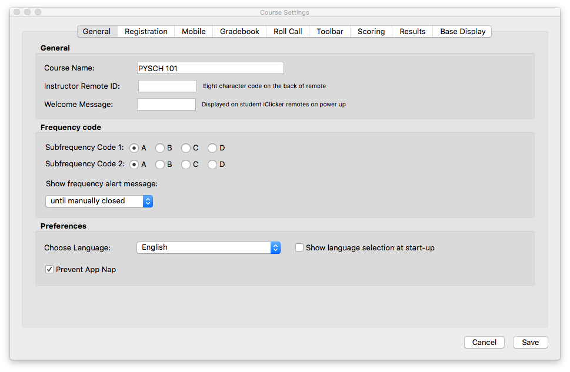

# Initial Set Up

### Register

1. Open the iClicker app from the iClicker folder on your flash drive.
2. Enter your name and email.
3. Type **San Diego State University** in the Primary Institution Field.
4. Select `Register`.

### Create your Course

1. Create a new course by selecting the `+ Create` button.
2. Type in the name of your course (eg. PSYCH 101).
3. Select `Create`.

# Settings

1. Highlight the name of your course.
2. Select `Settings`.

### General Tab

1. Enter your **Instructor Remote ID**, which is found on the back of your blue remote. \(Enter this number carefully as this is used to start and stop polls, display polling results, and set a correct answer.\)
2. In most cases, you will be using **Frequency Code** AA

> **[info] Tips**
>
> You may want to turn off the frequency alert message as it will display
> every time you open the software. Select the drop down menu located 
> beneath "**Show frequency alert message**" and choose `not at all`.
>
> If you are using a Mac, you may want to click on **Prevent App Nap** 
> to prevent your software from "sleeping" between questions.

The `Registration` tab does not require any alterations.

If you are going to allow web-based polling in your course, click the `Mobile` tab. If not, move on to the `Gradebook` tab.

### Mobile Tab

>**[warning] Attention**
>You should **NOT** create a separate iClicker Reef account _outside_ of the
>iClicker application. Creating a separate iClicker Reef account on the 
>iClicker Reef website will create a new, separate course that is not linked 
>to your iClicker course and students will not be able to join polls or quizzes.

1. Select `Enable`
2. Fill in the required fields
3. Select `Sign In`

1. Fill in the **Course Name**. It's a good idea to add the semester, too. (eg. Psych 101 Spring 2018)

2. Fill in the **End Date**. This ensures that the course will no longer be visible to students after the semester has ended.

3. Choose your **Screenshots** preference. Some faculty choose to allow students to see screenshots for studying purposes. Most faculty choose "Do not allow."

4. Click "Create"

>**[warning] Important**
>Students who use iClicker Reef MUST enter their RedID 
>as their student ID in order to be recognized by Blackboard.

### Gradebook Tab

iClicker integrates with Blackboard making it easy to download your roster and upload grades. Your course must be "available " so that iClicker can make the connection.

Click on “**Select Course**” to start the connection process. A login window should appear.

If you don't see "Select Course," you might not have the Blackboard integration software.

You will need to get your SSO key from Blackboard in order to connect iClicker to Blackboard. The SSO can be found in any Blackboard course that you teach.

1. Go to Course Tools in the Control Panel. 
2. Click on “iClicker Instructor Tools” at the bottom of the list. 
3. Click "SSO Security Key" and copy the Security Key \(The CMS username is your RedID\). 
4. Enter your RedID in LMS Username and the Security Key in the appropriate box.
5. Click "Save my credentials ..." and then click "Log in"

A drop down menu should appear. Click on your course and then click "Select".

  

Once you select your course, you will be notified that your roster will not appear until you sync with your LMS. This message can be safely ignored, as you will sync your roster using the iClicker Gradebook later.

### Toolbar

While you are polling your students, iClicker will display a small Toolbar on your screen with pertinent information for both you and your students.

The most important option is the Timer. By default, polls only close when you close them. Many users choose to have a “Count Down” timer which closes the poll automatically when the time elapses. This eliminate having to tell students when the poll will close.

You can enter the desired poll duration in the box using the dropdown menu.

### Scoring

Think of the Participation Points as “Attendance” and the Performance points as “Quiz Points".

Participation Points and Performance points can be uploaded to Blackboard as separate columns if desired or as a grand total.

Many instructors are moving away from “Participation points”, favoring “Points for responding” instead to keep students engaged.

Save your settings before you exit. You are now ready to begin a polling session.

