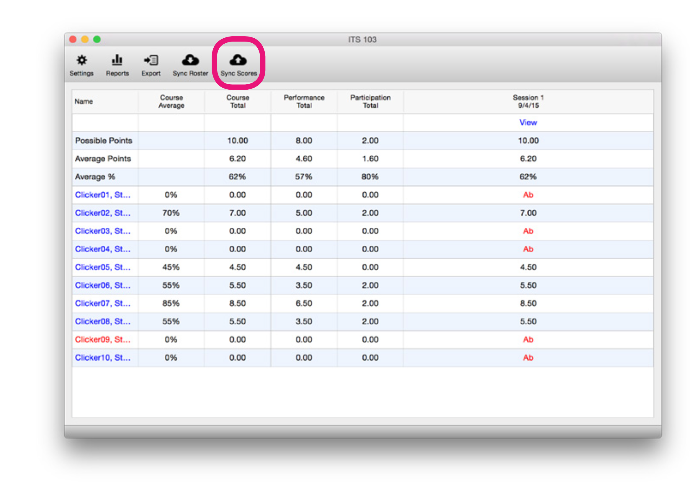
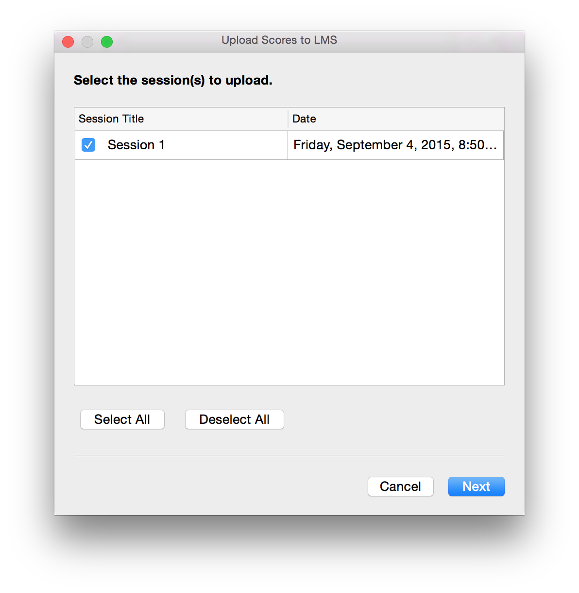
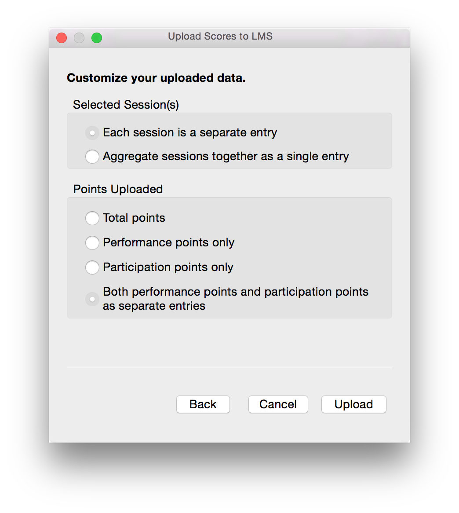

# Uploading Scores

When you are ready to upload your scores, go to your Gradebook and click the `Sync Scores` button. We recommend that you sync your roster before you sync your scores.

Choose the session(s) that you want to upload, and click `Next`. If you have already uploaded a given session, the grades for that session will be updated if you changed the grading or students registered their clickers since you uploaded the grades originally.

Finally you can configure how you want your scores uploaded. Many students prefer that each session be uploaded as a separate entry as it gives them greater insight into their grades.
